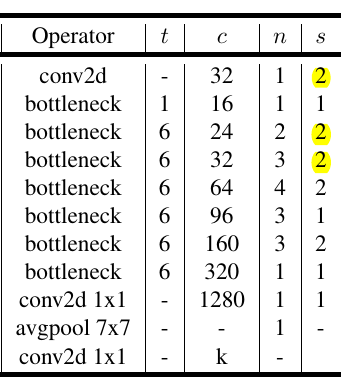
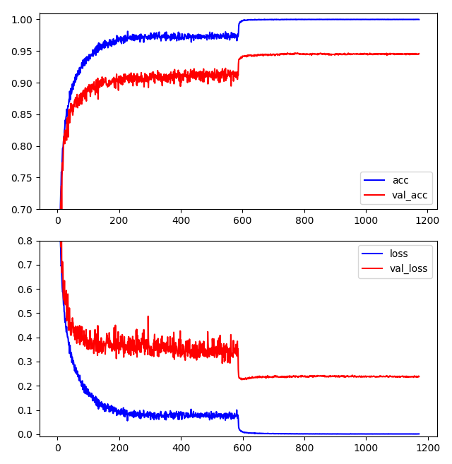

# mobileNet-v2_cifar10
a pytorch implement of mobileNet v2 on cifar10

### architecture

* The origin  mobileNet  architecture is designed specifically for ImageNet where images' size is 224x224x3. To make it fit cifar10's size (32x32x3), I have disabled some downsample layer, i.e. replace the first few layers which have stride 2 with stride 1, as highlighted below.

  

### training

* Run `python3 train.py` to start training
* Run `python3 plot.py` to show training curve

* I have trained this model (width multiplier = 1, more setups can be seen in `train.py`) on two titan x, which takes about 6 hours, the weights and logs are available in folder `bak`

### result

* The model can achieve max / mean accuracy 94.69% / 94.52% on validation set. Here the "mean accuracy" refers to mean of last 10 accuracy.

* accuracy & loss - iterations curves are shown below:

  

### dependency

* python 3+
* pytorch 0.4.0